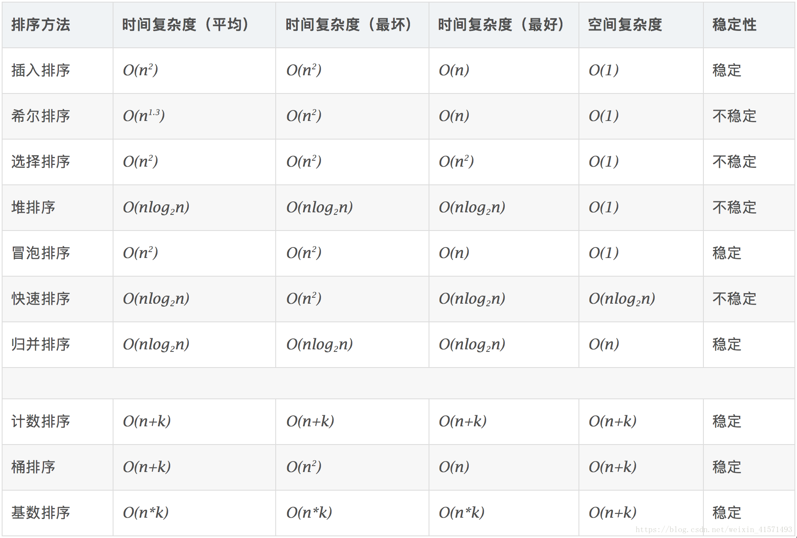

###图书管理系统优化2.0 (标注的line可能不准确，最好对照该代码修改)
***
#### 一、关于书籍节点添加了一个属性borrow_times一系列的修改
##### 1. 在book_node.py里添加了borrow_times属性代表借阅次数，后续可根据热度排序
##### 2. mysql_operate.py修改
book_add()函数里85line添加：   
```python
borrow_times = '0'
```
book_add()函数里86line修改:
```python 
sql_1 = "INSERT INTO books VALUES('%s', '%s', '%s', '%s', '%s', '%s', '%s','%s','%s','%s')" %(book_id, name, author, class_name,ISBN, publish, borrow_state,'','',borrow_times)
```
borrow_state_change()函数添加了borrow_times参数 ；line126 改为            
```python
sql_3 = "UPDATE `libraray`.`books` SET `borrow_date` = '%s', `return_date` = '%s', `borrow_times` = '%s' WHERE (`book_id` = '%s')" %(borrow_date, return_date, borrow_times, book_id)
```

##### 3. 在reader_operate.py修改
BookList_init()函数里添加：     
```python
node.borrow_times = result[i][9]
```

books_info()函数里添加： 
```python
BookList[i].borrow_times,"   "
```
book_borrow()函数里添加了
```python
find_result[0].borrow_times = str(int(find_result[0].borrow_times) + 1)
```
book_borrow()函数里line176改为
```python
self.db_opt.borrow_state_change(book_id, now_str, future_str,find_result[0].borrow_times)
```

#### 二、book_find_new设计(用于前端模糊搜索设计)
##### 1.在reader_operate.py里修改
头文件添加 
```python
import re
```
添加了book_find_new()函数，其参数这次只有一个value，相比于之前去掉了key参数


#### 三、排序
#### 字母根据ASCII码排序；汉字根据utf-8编码排序
#### 1.冒号排序 
在reader_operate.py里的book_bubble_sort()函数里
#### 2.插入排序
在reader_operate.py里的book_insert_sort()函数里
#### 3.希尔排序
在reader_operate.py里的book_shell_sort()函数里

####最终在查找算法里使用的是希尔排序，但希望写报告的同学可以在报告里比较三种排序的复杂度
#### 参考博客
##### [史上最简单十大排序算法（Python实现）](https://blog.csdn.net/weixin_41571493/article/details/81875088)

#### 四、book_find算法优化(将遍历算法优化为二分查找算法)
####在book_find()前添加三、里的排序函数函数
####修改了book_find()函数
#### 1.顺序查找 
在reader_operate.py里的book_find()函数里，注释掉了
#### 2.二分查找(改良版)：(重点)解决了有重复值的问题
目前在reader_operate.py里的book_find()函数所使用的算法


####参考博客
##### [八个常用查找算法——python3实现](https://blog.csdn.net/u014597198/article/details/90645537)